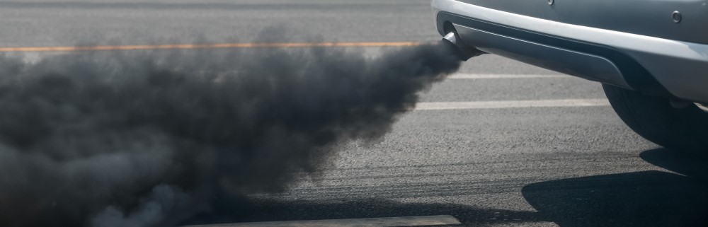

# PyCars : Predicting CO2 emission using AI through Machine Learning

## Context

Each year, the **European Environment Agency (EEA)** compiles and publishes a database for monitoring CO₂ emissions from passenger cars.
From these data, the goal of this study is to **identify the technical characteristics involved in the CO₂ emission rate** and to **establish a predictive model of the pollution engendered by new vehicle types**.

## About the project

This repository contains the exploratory report and the code for our project **PyCars**, developed during our Data Scientist training at [DataScientest](https://datascientest.com/). This training was co-certified by the [Ecole des Mines Paris - PSL](https://www.minesparis.psl.eu/).

This project was developed by the following team :

- Isabelle Evrard ([GitHub](https://github.com/) / [LinkedIn](https://www.linkedin.com/in/isabelle-evrard-82a6b2253/))
- Anthony Lebret ([GitHub](https://github.com/AnthonyLebret) / [LinkedIn](https://linkedin.com/in/anthony-lebret-a7aabb176))

You can click on the following links to access to our :
- [Code/Notebooks](./notebooks)
- [Report](https://github.com/AnthonyLebret/PyCars/blob/05c990694a4a8990b8504d4076df3c9380e2000d/Rapport%20Exploration.pdf)
- [Interactive Streamlit app](https://pycars.streamlit.app/)
